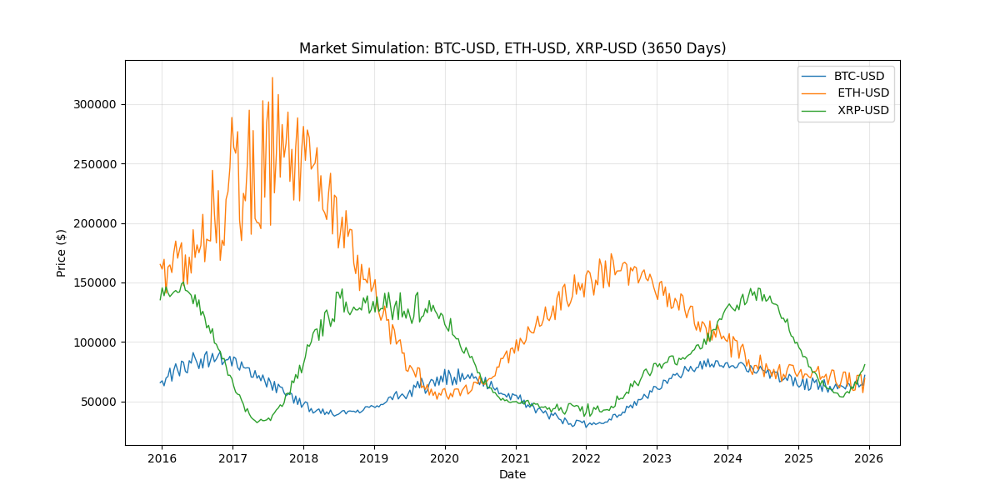

# Market Mock

This project is a deterministic market data simulator written in Go. It provides a web server that exposes an API to get simulated OHLC (Open, High, Low, Close) candle data for financial instruments.

The simulation is deterministic, meaning that for a given symbol and time, it will always produce the same data. This is achieved by using a hashing function on the symbol and time to generate the price data. This makes the data look random, but it is actually predictable.

I made this project to simulate real time series data to test data structure and and visualization tools. this data is **NOT** to mimic behavior of real markets only its data shape. **NEVER** use it for regression or any kind of prediction.


## Running the project

To run the project, you need to have Go installed.

1. Clone the repository.
2. Run the application:
   ```bash
   go run .
   ```
3. The server will start on `http://localhost:8080`.

## API Usage

The server exposes a single endpoint to get candle data:

`GET /api/candles`

### Query Parameters

- `symbol`: A comma-separated list of symbols to get data for (e.g., `ETH-USD,BTC-USD`).
- `days`: The number of days of data to return (default: `30`).
- `interval`: The time interval for each candle (e.g., `1h`, `24h`). Default is `24h`.

### Example

```bash
curl 'http://localhost:8080/api/candles?symbol=ETH-USD&days=5&interval=1h'
```

This will return a JSON response with the candle data for `ETH-USD` for the last 5 days with a 1-hour interval.

## How it works

The core of the simulation is in the `engine.go` file. It uses a deterministic hashing approach to generate price data. The `GetPrice` function takes a symbol and a time, and returns a price. This is done by:

1.  Hashing the symbol to get a base price and volatility.
2.  Using a time-based multiplier to simulate price evolution over time.
3.  Adding some noise to the price.

The `GetOHLC` function then uses `GetPrice` to generate a candle by sampling the price at different points in time within the candle's duration.

## Generating a Plot

The project includes a Python script (`plot.py`) to visualize the generated data. To use it:

1.  Make sure you have Python and the `pandas` and `matplotlib` libraries installed.
2.  Get some data from the API and save it to a CSV file named `market_data.csv`. You can also use the included `market_data.csv` as an example.
3.  Run the script:
    ```bash
    python plot.py
    ```
4.  This will generate a plot of the data and save it as `market_simulation.png`.

The included `market_simulation.png` is an example of the output:


